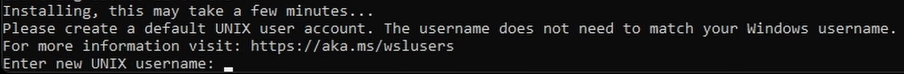
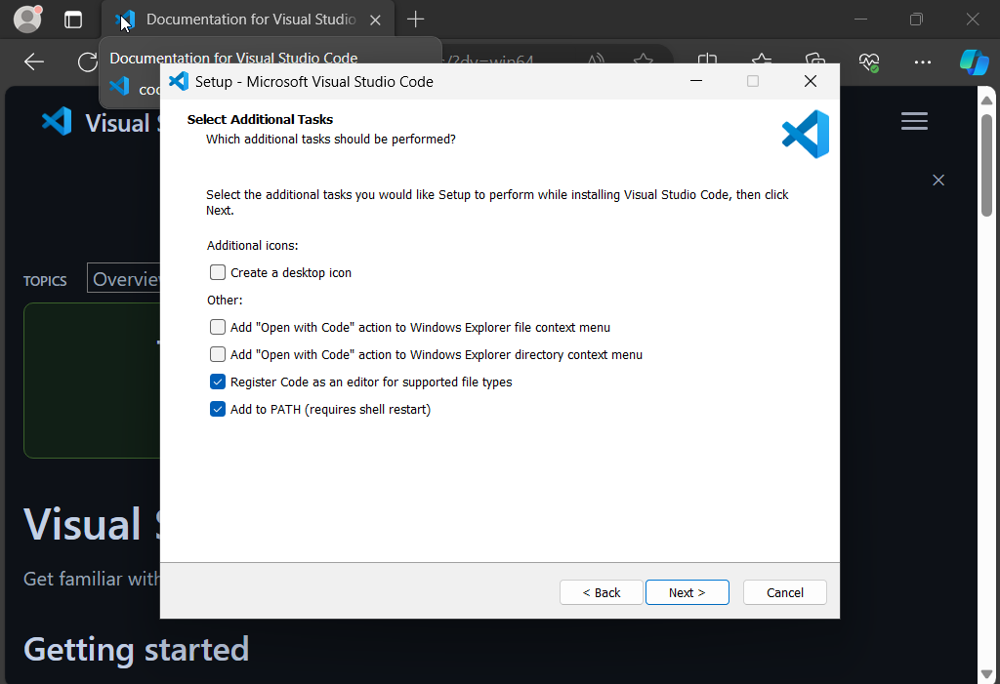

# Instructions to get started on WSL
The **Windows Subsystem for Linux**, or WSL, allows you to run a Linux environment on Windows without the need for a virtual machine or dual-booting. If you use Windows and want to use Linux for applications that do not have a GUI,[^1] you are most likely better off using WSL. Programming is the most common example of such a use case. 
## 1. Install WSL
The first step is to install WSL. Open the PowerShell application as administrator (by right clicking and clicking "Run as administrator") and type the command `wsl --install` into the terminal, then press enter. You should first see WSL and the Ubuntu distribution being downloaded and installed. Once both are complete, restart your computer. After restarting, open PowerShell as administrator again and run `wsl.exe --install Ubuntu` to complete the Ubuntu installation. You will be prompted to create a username and password.



Your username must start with a lowercase letter and can only contain lowercase letters, dashes (`-`) and underscores (`_`). It can optionally end with a dollar sign (`$`). When entering your password, no dots or asterisks will appear for each character, so make sure you enter it carefully. You are now finished installing WSL.

## 2. Install Visual Studio Code
Visual Studio Code is a popular text editor which provides many facilities for development such as syntax highlighting and code completion. Its integration with WSL allows you to develop in a Linux environment on Windows. If you already have VS Code installed and it is in your PATH, then you can skip this step. If you are not sure what PATH is, run the installer again anyway (no need to uninstall VS Code first).

To install, go to the [VS Code website](https://code.visualstudio.com/Download) and download and run the Windows installer (**not Linux**). When the installer asks you to select additional tasks, select "Add to PATH",[^2] as shown below.

  

## 3. Install the WSL and C/C++ extensions
Once VS Code is installed, you next need to install the [WSL](https://marketplace.visualstudio.com/items?itemName=ms-vscode-remote.remote-wsl) and [C/C++](https://marketplace.visualstudio.com/items?itemName=ms-vscode.cpptools) extensions by Microsoft. When you click install on the website, your browser should prompt you to open VS Code. Click open, then click install. Alternatively, you can open the Extensions tab in VS Code (Ctrl+Shift+X) and search for them. Then install both of them.

## 4. Install GCC
You may have installed WSL, but not all packages (programs) are necessarily up to date. Just as you regularly check for new updates on your phone or laptop, updating packages is a best practice on Linux. APT (Advanced Package Tool) is a *package manager*, a program that keeps track of all programs installed on your system. It automates installing, updating, and removing programs for you. Open the WSL terminal by typing "WSL" in the Windows Start Menu. You should see `username@laptopname:~$`. This is called the command prompt, and it indicates that the terminal is ready to accept commands. The portion after the colon is the path (address) to the *working directory*, the directory you are currently in (`~` is the home directory of your user). Any command that you run in the terminal is run from the working directory.[^3] To update your packages, run the command `sudo apt update && sudo apt upgrade`.[^4] You will be asked to enter your password.
You will also need to install GCC, a C compiler. You can do this by running `sudo apt install gcc`.

## 5. Set up your workspace
Now you are ready to do some programming.  Start by making a new directory in which to store your programs. To do this, run the command `mkdir <name>`.[^5] This creates a new directory inside the working directory. For example, to make a directory called programs, run `mkdir programs`. If your desired name contains spaces, enclose it in quotes, e.g. `mkdir "CS F111"`. Next, to move into the directory you just created, run `cd <name>`.[^6] `cd` changes the working directory.[^7] Finally, open the folder in VS Code with `code .` (make sure to include the full stop).[^8] You should see VS Code installing and fetching the various things required to connect to WSL. Once you see a WSL indicator in the bottom left, you are ready. In the Explorer tab on the left hand side, right click and select "New File" and make a new C file (for example, "first.c"). And you're done! Here's some sample code for you to run.
```c
#include <stdio.h>

int main() {
    printf("Hello world!\n");
    return 0;
}
```
Copy and paste this into your C file. To compile and run the code, click on the Terminal tab at the top of VS Code and click New Terminal. Then run `gcc first.c` in the terminal.[^9] This compiles the file and create a new executable file "a.out" in your folder. Now run `./a.out`. You should see "Hello world!" in the terminal.
#
Congratulations! You have run your first C program on WSL. You can always create more directories and C files for different programs.

[^1]: In fact, WSL recently started supporting running Linux GUI apps on Windows for some processors. 
[^2]: This ensures that WSL knows where VS Code is installed.
[^3]: You can always check the path to the working directory by running `pwd` (print working directory).
[^4]: `apt update` refreshes the list of available packages, and `apt upgrade` installs all available updates for packages on your system. 
[^5]:  **m**a**k**e **dir**ectory
[^6]: **c**hange **d**irectory
[^7]: In general, `cd` takes a path (an address) to a directory as an argument. For example, if the home directory contains a folder called programs and programs contains another folder called Lab01, then you can move to Lab01 by running `cd ~/programs/Lab01/`. 
[^8]: `.` is the path to the working directory, and `..` is the path to the parent directory of the working directory (one level up).
[^9]: Just like `cd`, `gcc` also takes a path as an argument. When you type `first.c`, the path used is `./first.c`. Regardless of path, the executable is created in the working directory with name `a.out`. You can change this by adding the `-o` flag to your compile command i.e. `gcc -o path/to/executable path/to/source.c`.